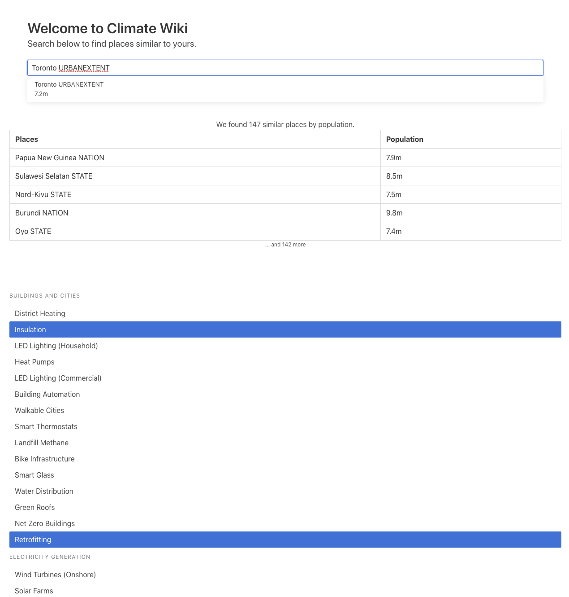

# Civic Hack 2019

This is a hack we did for Civic Hack 2019 in Seattle.
You can open the HTML and use the source_data in the `src/` directory to start.

You can view the demo here as well.
https://drive.google.com/open?id=1Sh1X-s9qC1r8w1Hh3S1bnNgET1PusadS

- [Live Demo](https://overload119.github.io/civichack2019/index.html)
- Be sure to input the CSV that can be [downloaded here](https://github.com/Overload119/civichack2019/raw/master/src/source_data.csv).

## Development

- `yarn`
- `yarn run dev`
